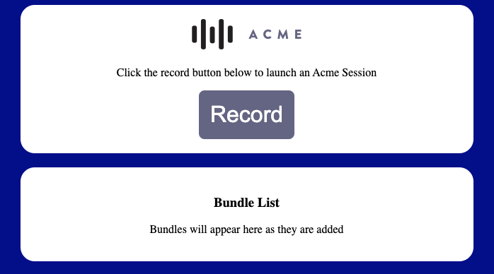

# Sample Core SDK Application

:warning: This application requires the Moonsense Web Core SDK. The Core SDK does not integrate with the Moonsense Cloud requires separate licensing. If you are interested, please reach out to support@moonsense.io.

This project demonstrates how to create an SDK that integrates the Moonsense Web Core SDK. The project includes an SDK created for a fictitious company named `Acme`. The file [AcmeSdk.ts](src/AcmeSdk.ts) is the primary entry point for the SDK. The SDK is setup with two extenal facing functions `intialize(...)` to setup the SDK and `record()` to launch an `AcmeSession`. When an `AcmeSession` is started, it also launches a Moonsense Session to record the available sensors. The AcmeSDK then pushes bundle data via HTTP request to a backend application.

This project also includes a sample website that makes use of the Acme SDK and provides a POST endpoint for use by the Acme SDK. For more information on the sample website, look in the [dev-site](dev-site) folder.

<p align="center">
    
</p>

## Setup

The node dependencies must be installed to work on the project. To install the dependencies, run:

```
npm install
```

## Usage

The SDK provides an `initialization(...)` function that must be called prior to any recordings. This function expects a [Config](src/models/Config.ts) object to be passed as a parameter. Here is an example of how to initialize the SDK:

```javascript
const bundleCreated = (session, bundleId) => {
    console.log('Bundle Created', {session, bundleId});
};

AcmeSdk.initialize({
    postBaseUrl: 'https://localhost:3100',
    authUsername: 'post',
    authPassword: 'password',
    bundleCreated,
});
```

Once initialized, a recording can be started. To start a recording, simply call the `record()` function of the SDK.

```javascript
AcmeSdk.record();
```

## Build

To build the SDK, run the following command from the project directory:

```
npm run dev
```

This will build the application and automatically update the build as changes are saved. 

The output of the build is stored in the `dist` directory.