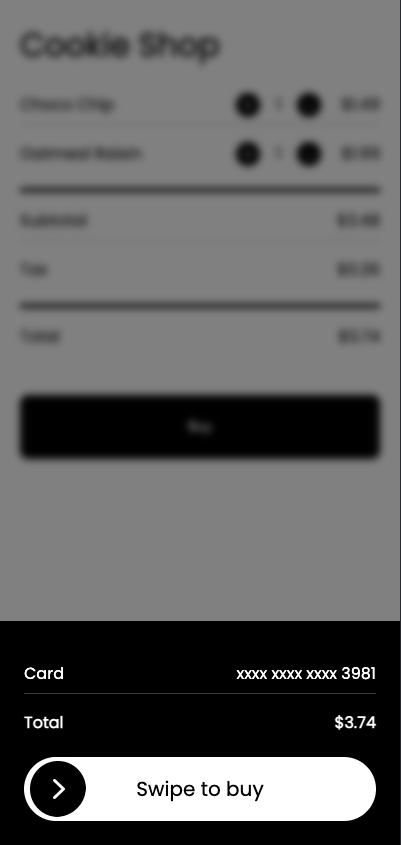

# Moonsense SDK - Sample React App

This app is a very basic React Application that includes the Moonsense SDK. The SDK is wired into a 
modal that offers a 'Swipe to Buy' widget. The SDK is setup to record while that modal is open.

A [MoonsenseSdk](src/Moonsense.js) singleton wrapper has been created for convenience.

All logic for the App and usage of the SDK are in the [App.js](src/App.js) file.

<p align="center">
    
</p>

## Setup

Included is a file named [api-key-sample.js](src/api-key-sample.js). This file shows the structure used by this app to specify the Moonsense Public Token needed to associate this project with an App on the Moonsense Console. 

Copy `api-key-sample.js` to `api-key.js` and replace the value with the Public Token obtained on the [Moonsense Console Apps page](https://console.moonsense.cloud/apps), then clicking on the App you want to associate this project with, and either copy an existing Public Token or click `Create Token` and to get a new one.

## Running the App

To run the app locally, simply run the following command:

```
npm start
```

This will launch a local webserver that will serve the react app. Then you should be able to navigate to the page in your brower. Clicking the `Buy` button will trigger the creation of a Moonsense Session and will start recording sensor data. The session ends after a duration of 10 seconds or swiping all the way to the right. Whichever comes first.

Data for the Session can then be viewed on the [Moonsense Console](https://console.moonsense.cloud) on the Sessions page for your associated App.

## NOTE

For the sensors to be accessible through the browser, the application must be running in a secure context. For this reason the app is launched with `HTTPS=true` and you may see security warnings when navigating to the page. Chrome disallows navigating to insecure localhost pages by default but provides a flag for allowing them. More can be found by navigating to `chrome://flags/#allow-insecure-localhost` in Chrome.

> :warning: **You will not see data without running on HTTPS**