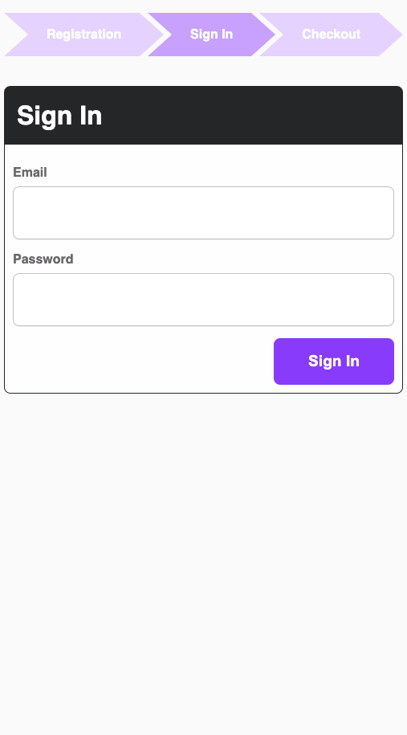

# Moonsense SDK - Sample React App

This app is a very basic React Application that includes the Moonsense SDK. The application walks through a sample new user flow: Registration > Sign-in > Cart > Payment. The steps do not need to be followed in that particular order however the application will step through the stages in that order by default. 

At each stage, two sessions are created. A short-lived session tracks the device motion sensors (i.e. accelerometer, gyroscope, etc...) and a long-lived session tracks page interaction (i.e. pointer, text changes, etc...).

<p align="center">
    
    
    
    
</p>

## Setup

Included is a file named [api-key-sample.js](src/api-key-sample.js). This file shows the structure used by this app to specify the Moonsense Public Token needed to associate this project with an App on the Moonsense Console. 

Copy `api-key-sample.js` to `api-key.js` and replace the value with the Public Token obtained on the [Moonsense Console Apps page](https://console.moonsense.cloud/apps), then clicking on the App you want to associate this project with, and either copy an existing Public Token or click `Create Token` and to get a new one.

## Running the App

First make sure all the dependencies are installed:

```
npm install
```

To run the app locally, simply run the following command:

```
npm start
```

This will launch a local webserver that will serve the react app. Then you should be able to navigate to the page in your brower. The menu will be displayed allowing you to navigate to the page you want. Sessions will be created automatically on each page.

Data for the Session can then be viewed on the [Moonsense Console](https://console.moonsense.cloud) on the Sessions page for your associated App.

### NOTE

For the sensors to be accessible through the browser, the application must be running in a secure context. For this reason the app is launched with `HTTPS=true` and you may see security warnings when navigating to the page. Chrome disallows navigating to insecure localhost pages by default but provides a flag for allowing them. More can be found by navigating to `chrome://flags/#allow-insecure-localhost` in Chrome.

> :warning: **You will not see data without running on HTTPS**


## Labeling Data

The app will automatically label each of the steps with a label identifying the step. Using other labels can be done by including a `labels` query parameter. For example, adding the following to the url `?labels=BotDetection,SampleApp` would store the sessions with the labels `BotDetection` and `SampleApp` in addition to the default label. 

## Development and Usage Flags

The following flags can be added as query parameters to change the usage of the application.

* **noSessions=true**: disables the creation of sessions. Especially useful during active development of the pages

* **noFlow=true**: disables automatically stepping through the flow of the application. This flag allows the repeated use of the same page over and over.
